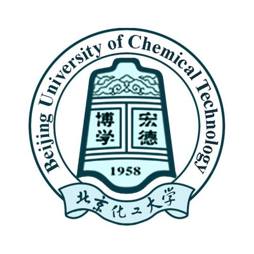

# Book-management-system
[中文说明](https://github.com/NoahsArk36/Book-management-system/blob/master/README-CN.MD)

The final course of the C language course of Beijing University of Chemical Technology, which is provided to the junior male schoolmates and junior female schoolmates for reference. 

Please do not copy the code completely. 

This program has many shortcomings，please improve by yourselves if the code is insufficient.

Original code author：NoahsArk36.

This program is a completely open source, please do not use it for commercial purposes.

